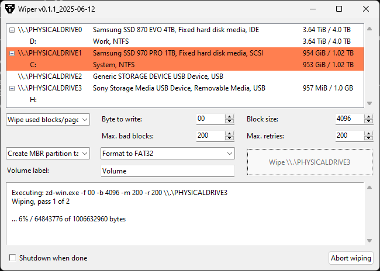

# Wiper

Windows GUI tool written in Python and C to securely wipe drives with an option to treat SSDs gently.

It includes the command line utility zd-win that wipes hard drives by overwriting. Wiper provides a GUI and the option to create a file system and write a log file.



## Installation (Developers)

Clone the repository. You need Python >= 3.12. The make batch script uses gcc (e.g. mingw-w64) and Nuitka to build the executables:
```
$ python -m pip install -U nuitka
```
The batch make script `make-dist.bat` needs to be edited. You have to customize the path to gcc. Nuitka should work out of the box after it is installed via pip.

Run the script:
```
$ make-dist.bat
```
Now the folder `wiper.build` contains the necessary files to run the application anywhere without a Python environment.

Be aware that Nuitka might not work with the newest Python version.

## Download

Download the latest release from GitHub and unpack it anywhere. It is a portable application. No installation is required.

## Language

By default, the English `labels.json` is used. You might delete this file in the app folder and rename `labels_de.json` to `labels.json`. For other languages, just edit `labels.json`.

## Usage

Launch the executable `wiper.exe`. Administrator privileges are required.

If you have Python installed, you can run `python wiper.py` directly within an administrator terminal / PowerShell window.

The following tasks can be executed by Wiper:

1. Wipe used blocks/pages ("selective"):
   Every block is checked and wiped if bytes not equal to the given value/byte (given in hexadecimal notation, 0 by default) are found. This is intended for solid state drives. This avoids unnecessary write operations. Ideally, the block size is set to the page size of the flash memory (usually 4096 bytes).

2. Overwrite every byte ("full"/"all bytes"):
   Every byte is overwritten.

3. 2-pass wipe ("extra"):
   The first pass writes a random block-sized pattern and the second pass writes the given value (0 by default).

4. Do not wipe but verify:
   This compares every byte with the given value (0 by default). This will only report no errors if the drive is completely clean, with no file system or partition table. The three options above always run a verify pass after wiping.

You can set the value/byte to overwrite with and the block size for writing (and reading). Additionally, you can choose after how many read or write errors a block is considered bad and how many bad blocks are tolerated before aborting the wipe or verify process.

If you choose to create a partition table (GPT or MBR) and a file system (NTFS, exFAT or FAT32), a log file will be written to the new volume (one partition, entire drive, given label).

Geeks might run:
```
zd-win.exe -h
```
This shows what the command line tool can do.

## Legal Notice

### License
Respect GPL-3: https://www.gnu.org/licenses/gpl-3.0.en.html

### Disclaimer
Use the software at your own risk.

This is not a commercial product with an army of developers and a department for quality control behind it.